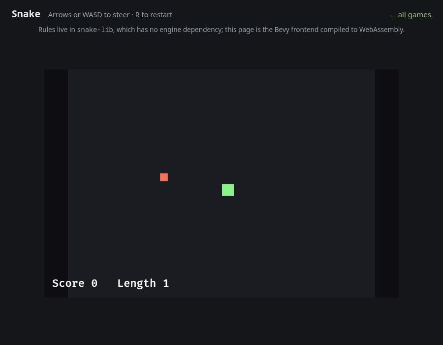
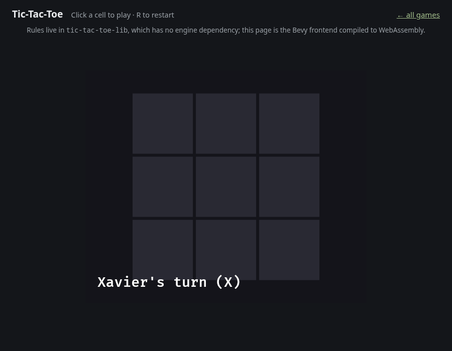
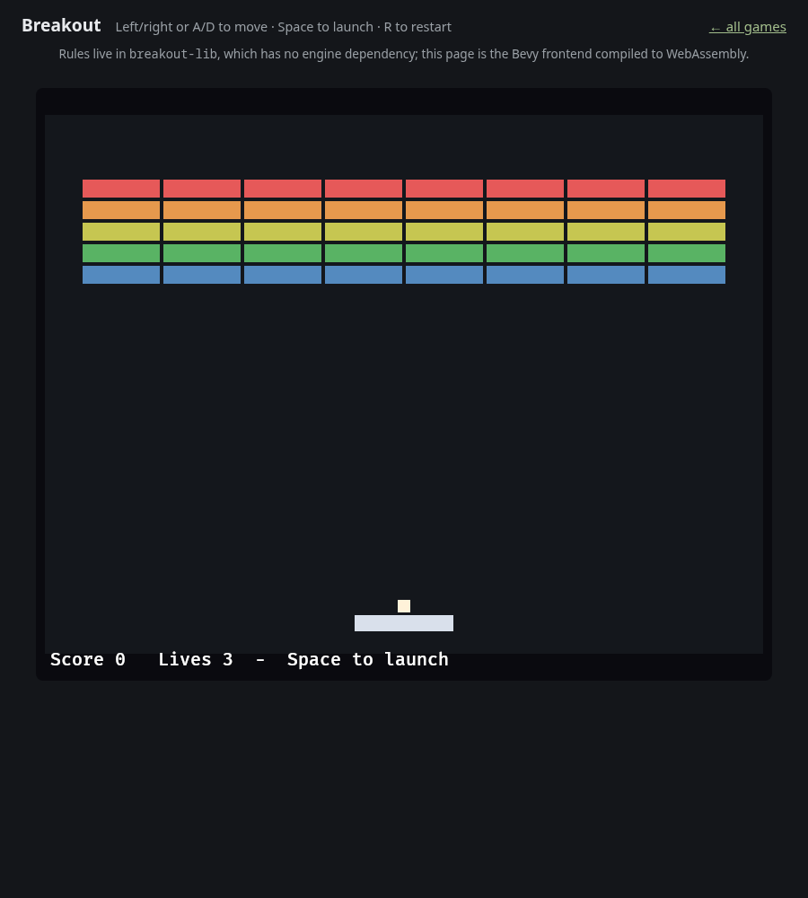

# tiny-rust-games
A repository for building very simple games using Rust and its various game engines.

The purpose of this repository is to hold example implementations of some very simple, well-known games. Each game is built with three goals in mind:

1. The code for the game should be transparent and idiomatic so that it can be used for educational purposes.
2. The code should be portable so that it can be used across many game libraries and distributed on many platforms. The code should be implemented in as many game libraries as possible as a proof of concept for each system.
3. The code should be extensible so that others can use it as a starter template for a more complicated game of their own.
4. The core game logic should be factored into its own library and game engine agnostic wherever this heuristic can be sensibly applied so that the same code can be used across multiple engines. Wherever this goal detracts from goal number one, goal number one should take precedence.

The games are playable in a browser — the Bevy frontends compile to
WebAssembly, which is a build-target change rather than a rewrite precisely
because their rules crates never depended on an engine.

| | | |
|---|---|---|
|  |  |  |

Build the site with `just web`, preview it with `just web-serve`, and browse all
151 demos in the [generated catalogue](web/catalogue.html) — searchable by
concept, and produced from each demo's own module docs so it cannot drift.

## Repository layout

| Path | Contents |
|------|----------|
| [`tech-demos/bevy/`](tech-demos/bevy/) | 82 [Bevy](https://bevyengine.org/) `0.18` demos, each isolating one engine concept or gameplay system. A single Cargo workspace — see the [Bevy demo index](tech-demos/bevy/README.md). |
| [`tech-demos/godot/`](tech-demos/godot/) | 67 [Godot](https://godotengine.org/) `4.3` demos with game logic in Rust via [gdext](https://github.com/godot-rust/gdext) `0.5` — see the [Godot demo index](tech-demos/godot/README.md). |
| [`tech-demos/brackets/`](tech-demos/brackets/) | A [bracket-lib](https://github.com/amethyst/bracket-lib) mouse-control demo. |
| [`snake/`](snake/) | The second game: an engine-agnostic `snake-lib` with `-bevy` and `-godot` front-ends. Where tic-tac-toe proves the boundary for turn-based play, this proves it for **real-time** — the library owns the rules, never the clock. |
| [`breakout/`](breakout/) | The third game: continuous physics on a fixed timestep, with `-bevy` and `-godot` front-ends. Chosen because it looked like the one that would break the pattern — it did not, but it revealed that continuous state needs interpolated *rendering*, which discrete state does not. |
| [`tic-tac-toe/`](tic-tac-toe/) | The reference "well-known game": an engine-agnostic `tic-tac-toe-lib` core with **four** front-ends — `-cli`, `-brackets`, `-bevy`, and `-godot` (goals #2 and #4 in practice). |

The same tic-tac-toe rules drive a terminal loop, an ASCII console, Bevy's ECS,
and Godot's scene tree without any frontend containing a rule of the game — that
is goal #4 tested against architectures that genuinely differ, rather than
against two variations on a terminal.

Snake takes it further. A turn-based game only ever needs the library when the
player acts; a real-time one moves on its own, so *something* must own the
clock. `snake-lib` deliberately does not: it exposes `step()`, and ships a
`Ticker` that converts frame time into whole steps. Bevy feeds it `Time::delta`,
Godot feeds it `process(delta)`, and neither can disagree about how fast the
snake moves because neither one decides. Because nothing else enters a game,
[`snake-lib`](snake/) can record one: a replay is a board size, a seed and the
turns queued on each tick, which is a few hundred bytes of readable text that
reproduces a death exactly.

Breakout is the case that was supposed to break this. Floating-point positions,
floating-point velocities, and two engines that ship physics of their own. It
holds — on the condition that `step()` advances a **fixed** timestep rather than
a frame's elapsed time, which is what keeps it both deterministic and out of the
engine's hands. What it did add is interpolation: a ball simulated at 120 Hz and
drawn at 144 Hz judders unless rendering blends between steps. Rendering
interpolates; the simulation never does.

Every demo ships module-level rustdoc, and every demo with logic to exercise
ships a `#[cfg(test)]` test module — the sole exception is `bevy/draw-window`,
ten lines that open a window and contain no logic at all.

Each engine directory documents the shape its demos share:
[Bevy](tech-demos/bevy/DEMO_ANATOMY.md) and
[Godot](tech-demos/godot/DEMO_ANATOMY.md). Read the relevant one before adding a
demo.

Per-demo `README.md` files are reserved for demos whose architecture is not
obvious from the source; everything else is covered by the engine's demo index
plus the module rustdoc.

## The web build

```bash
just web           # build web/dist (games + catalogue)
just web-serve     # ...and serve it on localhost:8080
just catalogue     # regenerate the catalogue only
just screenshots   # refresh docs/images from the web build
```

`tools/build-web.sh` needs the `wasm32-unknown-unknown` target and a
`wasm-bindgen-cli` whose version matches the `wasm-bindgen` crate in
`tech-demos/bevy/Cargo.lock` — it prints the exact `cargo install` line if the
two disagree. `wasm-opt` is used when present and skipped when not.

Each game is roughly 25 MB of WebAssembly after optimisation, which is ordinary
for Bevy; the `wasm-release` profile in the workspace manifest is what gets it
there from 85 MB.

[`.github/workflows/pages.yml`](.github/workflows/pages.yml) publishes this to
GitHub Pages on every push to `main`. It needs Pages enabled for the repository
with **GitHub Actions** as the source.

## Benchmarks

A few demos claim something about performance. [`benchmarks/`](benchmarks/)
measures those claims against the naive implementation they say they beat:

```bash
just bench
```

The first run was worth the effort. `spatial-partitioning` documents "O(1)
neighbour queries" and displays a savings counter — both true — but at its
default of 60 balls the grid is **15× slower** than simply comparing every pair,
because rebuilding the bucket map costs more than the comparisons it saves. The
measured crossover is around four thousand entities. The demo's documentation
now says so; see [`benchmarks/README.md`](benchmarks/README.md).

## Continuous integration

[`.github/workflows/ci.yml`](.github/workflows/ci.yml) runs on every push and
pull request. It enforces, across every crate:

- `cargo fmt --check` — deliberately hand-aligned data tables opt out with
  `#[rustfmt::skip]`;
- `cargo clippy --all-targets -- -D warnings`, including `missing_docs` for
  every crate except the Godot demos (gdext's `#[export]` generates accessors
  that cannot carry docs);
- `cargo test`;
- `--locked`, so the committed `Cargo.lock` files are verified rather than
  silently updated;
- that all three games still build for `wasm32-unknown-unknown`;
- that the generated catalogue is not stale;
- that Linux, macOS and Windows produce **identical game state** from identical
  inputs. Both rules crates ship a `state-hash` example that digests the bit
  patterns of a finished game; CI compares the three platforms and fails if they
  disagree. Snake is integer-only and must agree; Breakout is `f32` throughout,
  where cross-target differences are permitted, which is exactly why it is
  measured rather than assumed;
- that every Godot project actually **loads** and registers its Rust classes.
  Compiling proves less than it looks: a `.gdextension` naming a library that
  does not exist, or a scene referencing an unregistered class, compiles fine
  and fails the moment anyone opens the project. `tools/validate-godot.sh` runs
  each project headlessly and inspects the log, because Godot reports those as
  errors and then exits 0 anyway.

The Bevy workspace is checked on Linux, macOS and Windows. The Godot suite is
Linux-only on purpose: it is 71 crates, and gdext's behaviour does not vary by
host in a way that would justify tripling that.

## Git hooks

`.githooks/` holds a pre-commit and a pre-push hook. Git does not use them until
you point it at the directory, which a fresh clone has to do once:

```bash
just install-hooks     # or: git config core.hooksPath .githooks
```

**pre-commit** is deliberately fast (well under a second) and checks *staged*
content rather than the working tree, so a commit is judged by exactly what it
would introduce:

- staged `.rs` files are rustfmt-clean;
- no build artifacts or files over 1 MiB are staged;
- every Bevy demo directory appears in `[workspace] members`;
- all Godot crates pin one gdext version (they drifted to three once);
- a Godot crate's `[lib] name` matches the paths in its `.gdextension`;
- a Godot demo's module doc opens with `Teaches:`.

Nothing there compiles anything. Compiling this repository takes minutes, and a
pre-commit hook that slow only teaches people to reach for `--no-verify`.

**pre-push** runs `clippy -D warnings` and the tests, scoped to the crates the
push actually touches. It falls back to the whole suite when a shared file
changes (`tech-demos/bevy/Cargo.toml`, the workflow, the justfile, or
`tic-tac-toe-lib`), since those affect everything.

Both are bypassable with `--no-verify`, and neither replaces CI — they just
stop the cheap mistakes from getting that far.

## Building

```bash
# Bevy demos (shared workspace — Bevy compiles once):
cd tech-demos/bevy && cargo run -p hello-world

# Godot demos (standalone crates; Godot 4.3+ needed only to *run* them):
cd tech-demos/godot/hello-world && cargo build

# Snake and Breakout (Bevy windows):
just snake
just breakout

# Tic-tac-toe, four ways:
cd tic-tac-toe/tic-tac-toe-cli && cargo run                      # terminal
cargo run --manifest-path tech-demos/bevy/Cargo.toml -p tic-tac-toe-bevy
cd tic-tac-toe/tic-tac-toe-godot && cargo build                  # then open in Godot
```

With [`just`](https://github.com/casey/just) installed, `just` lists every
task — `just ci` reproduces exactly what CI enforces, and `just play` starts the
terminal game.

### Linux prerequisites

The Bevy and bracket-lib demos link against ALSA and udev (audio and gamepad
input) and, through `winit`, against wayland and xkbcommon. The Godot demos need
none of these — gdext bundles its own bindings.

```bash
# Debian / Ubuntu
sudo apt-get install -y libasound2-dev libudev-dev libwayland-dev libxkbcommon-dev

# Fedora
sudo dnf install -y alsa-lib-devel systemd-devel wayland-devel libxkbcommon-devel
```

Missing wayland headers surface as a `wayland-sys` build-script panic reading
`Package 'wayland-client' was not found`, which is easy to mistake for a Rust
problem.

If a bracket-lib demo fails while building its transitive `expat-sys`
dependency under CMake ≥ 4.0, build with `CMAKE_POLICY_VERSION_MINIMUM=3.5`.
